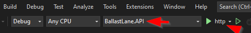
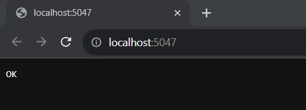
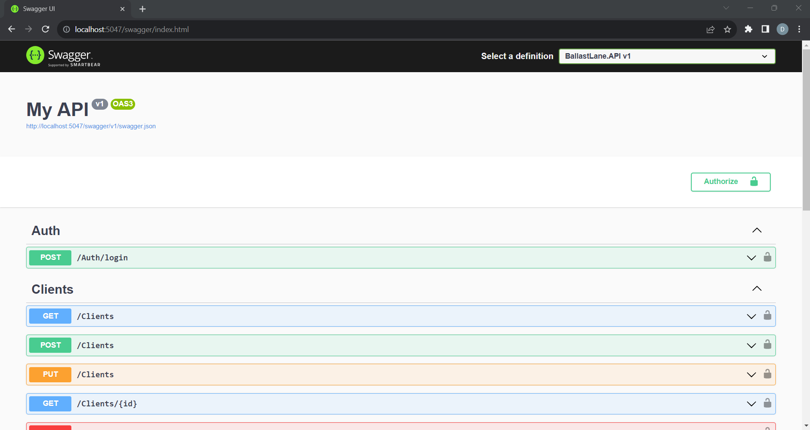
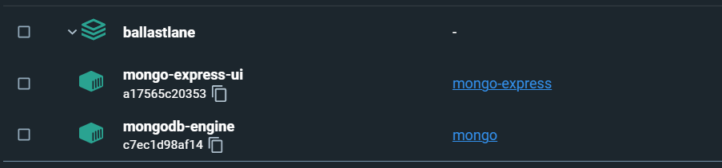
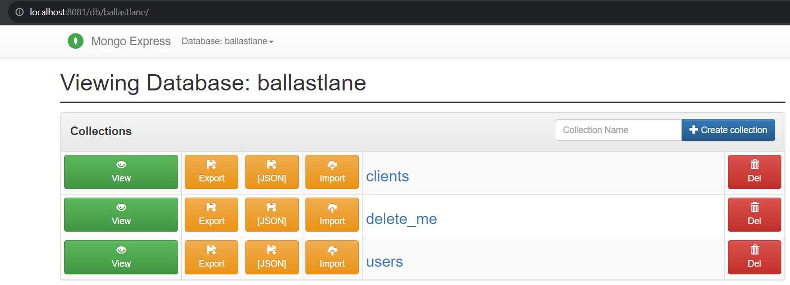

# BallastLane Technical Challenge

The solution for BallastLane .NET technical challenge.

## Quick Start

You will need to Have Visual Studio and .NET 7 installed on your system.

Open the [Solution File](./BallastLane/BallastLane.sln) with Visual Studio, it must perform an automated NuGet packages restoration and the solution must be ready to initiate by clicking the play button. Make sure the selected project is BallastLane.API and that you run with the http profile (.IIS express not configured):



The API will boot and a default browser window will open, the default route that will be opened is the health check at '/':



To open the sawgger just navigate to localhost:5047/sawgger:



The Database is not required to boot the API but to perform any operation you'll need to setup the MongoDB engine.

## Setting up MongoDB and Mongo Express

We assume you have Docker Desktop installed in your system.

A [Docker Compose](docker-compose.yaml) files is provided to install and run MongoDB engine and the Mongo Express UI. Run the following command:

```
docker-compose up -d
```

it will start pulling the required images and configuring the MongoDB engine and Mongo Express UI. Observe that for the MongoDB engine the user/password combination set is *admin/password*, this values are also being set in the Mongo Express so it can access the MongoDB engine, however, once the Mongo Express is up and running you can navicate to *localhost:8081* to access the Mongo Express UI and will be propmpted for credentials, for this case use *admin/pass* values.



once you're logged into the Mongo Express UI create a Database named *ballastlane* and two collections within it: *clients* and *users*:



Observe that the name of the Database can be changed in the [appsettings.json](./BallastLane/BallastLane.API/appsettings.json) file where the connection string to access the MongoDB engine from the C# code is also provided, however, the name of the collections cannot be changed by parameters at the moment.

Now you're ready to rock with the API, however, the only two endpoints accesible without credentials are the Heath Check and the Login, for the last one you'll require valid credentials for an user.

## Creating an user

To create an user you'll need to stop the API, manually edit the line X of the [Users Controller](./BallastLane/BallastLane.API/Controllers/UsersController.cs) to comment the *[Authenticate]* decorator to allow anonymous users. Once you do so you can create an user, make sure you include a password that:

- Has at least 8 chars in length.
- Includes at least an uppercase and a lowercase letter.
- Includes a number.
- Includes one of the following special chars: # $ * =

Observe that the Payload to create an user is provided in the swagger, just make sure you change the capitalization of the fields to PascalCase, use double quotes and include an empty Id if the operation is create:

```
{
  "Id": "",
  "Name": "YOUR NAME",
  "LastName": "YOUR LASTNAME",
  "Email": "YOUR EMAIL",
  "Username": "YOUR USERNAME",
  "Password": "YOUR PASSWORD"
}
```

